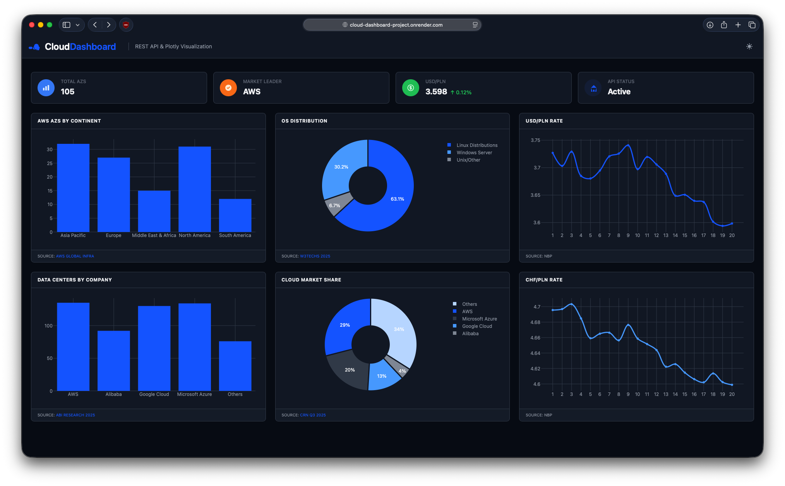

# Cloud Dashboard Project
 
A web dashboard visualizing cloud infrastructure and currency exchange data, built with Flask and Plotly.
 
**Live demo:** https://cloud-dashboard-project.onrender.com/dashboard



## Tech stack
 
- **Backend:** Python, Flask, SQLite
- **Frontend:** HTML, CSS, JavaScript, Plotly
- **Data sources:** NBP (National Bank of Poland) REST API, static data from AWS, W3Techs, ABI Research, CRN
- **Deployment:** Render (with Gunicorn)

 ## How to run locally
 
1. Clone the repo
```bash
git clone https://github.com/wpygun/cloud-dashboard-project.git
cd cloud-dashboard-project
```
 
2. Install dependencies
```bash
pip install -r requirements.txt
```
 
3. Initialize the database
```bash
python init_db.py
```
 
4. Run the app
```bash
python app.py
```
5. Open http://127.0.0.1:5000/dashboard in your browser

## API endpoints
 
| Endpoint | Description |
|---|---|
| `/api/os-distribution` | OS distribution data |
| `/api/cloud-market-share` | Cloud market share data |
| `/api/aws-availability-zones` | AWS availability zones by region |
| `/api/data-center-numbers` | Number of data centers by company |
